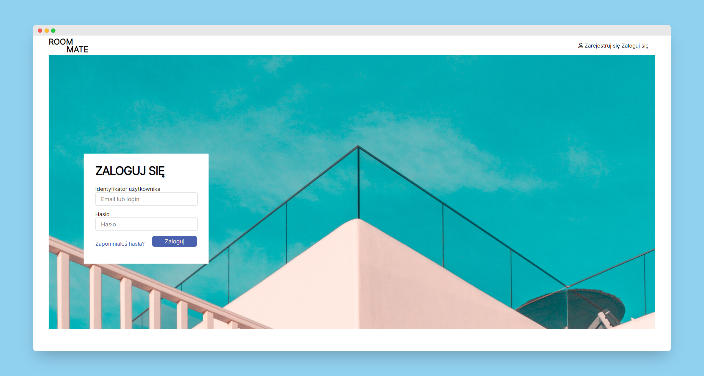
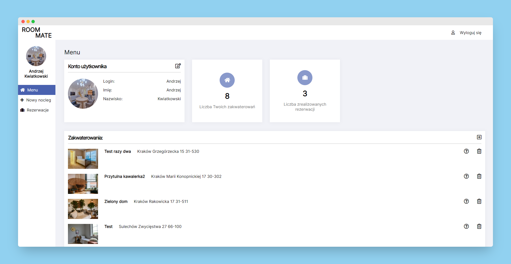
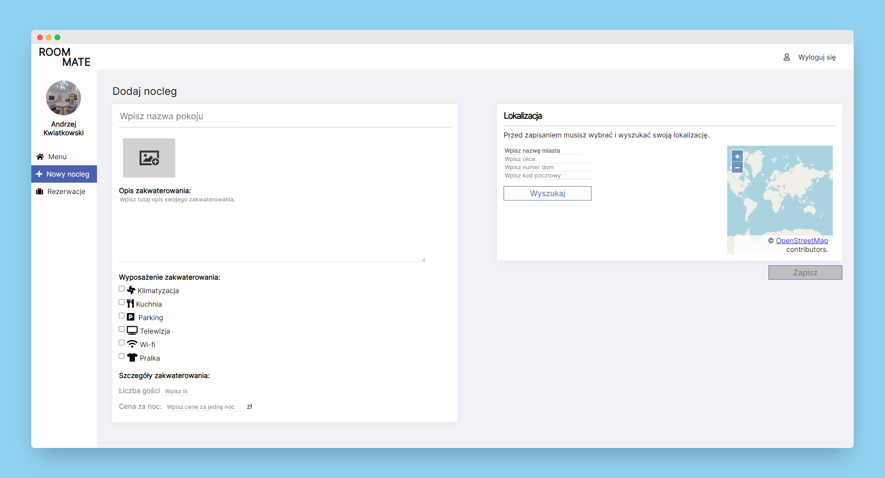
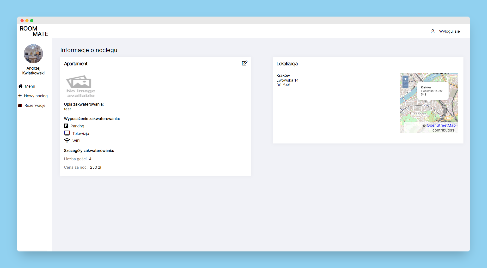
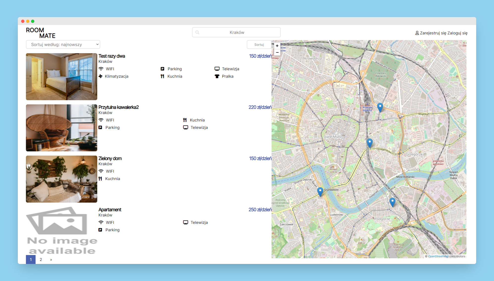
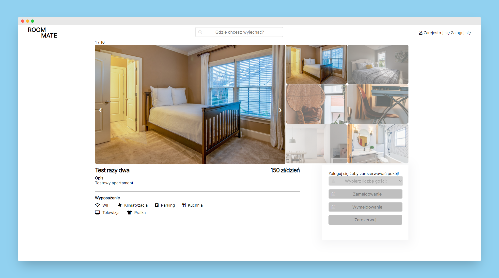

# RoomMate
>RoomMate is a web based accommodation booking application developed using asp net mvc. Application provides the main functions such searching accommodations, adding new flats , booking selected room and many others. 

## Table of contents
* [General info](#general-info)
* [Technologies](#technologies)
* [Features](#features)
* [Solution Projects](#solution-projects)
* [Screenshots](#screenshots)
* [Setup](#setup)
* [Configuration](#configuration)

## General info
RoomMate was created as a part of engineering work and the version on Github is a revised version, each part is in separate projects.
This application enabled me to remember a lot of information, teach design patterns such as the repository pattern with unit of work, and Model-View-ViewModel (MVVM).

The graphic design was designed using Adobe Xd, then fully transferred to code by me. Application code was created using c#, asp .net mvc, jquery. The application has a structure involving multiple projects that communicate with each other, the database was created using the entity framework code first.

Geolocation of accommodation was created using https://nominatim.openstreetmap.org, which provides a free api, I chose a free solution so that the number of search results is not limited. The map, which was used to display selected results is - openstreetmap. 

## Technologies
* .NET Framework 4.7.2
* ASP .NET MVC
* C#
* Entity framework - code first
* jQuery
* Html
* Css

## Features
List of features ready and TODOs for future development
* Session-based user registration and login system 
* Creating new users
* Mail account activation using SMTP protocol
* Password reset possibility 
* User dashboard to manage your accommodation
* Adding new accommodations 
* Editing accommodation 
* Viewing created accommodations
* Editing user account
* Viewing completed bookings 
* Search for accommodation according to parameters such as date, number of people and place 
* Sort accommodation by date and price 
* Responsive application that allows you to use it on all devices
* Booking of selected accommodation
* Displaying random accommodation on the homepage

To-do list:
* Responsive user dashboard
* Page displaying booking summary
* Fix adding and editing a user photo
* Create tests in assigned projects

## Solution Projects
| Project | Application Layer |
| ------------- | ------------- |
| RoomMate.Common | Utility Classes  |
| RoomMate.Common.Test | Tests for RoomMate.Common  |
| RoomMate.Data| Data Context , Repositories, Migrations and Unit of Work |
| RoomMate.Data.Test | Tests for RoomMate.Data  |
| RoomMate.Entities| Data Entities  |
| RoomMate.Entities.Test | Tests for RoomMate.Entities |
| RoomMate.Web | User Interface (views) and Business Logic (controllers) |

## Screenshots

## Setup
Description of the installation and creation of the database:
1. Download or clone this repository.
2. Open the solution in Visual Studio
3. Open a Package Manager Console window.
4. Select "RoomMate.Data" for Default Project.
5. Run: update-database

## Configuration

* The connection strings needed to properly connect to the database are found in the Web.config file in two projects - RoomMate.Data and RoomMate.Web. 
* In order to configure the email account needed to send activation messages, you need to change the email name in the EmailClient.cs file.

`private MailAddress domainEmailAdress = new MailAddress("here put your address email", "Room Mate");`

* Create a configuration file in your RoomMate.Web project and name it PrivateSettings.config then paste the code below adding your password needed to authenticate your email account. 

`<appSettings>
  <add key="MAIL_PASSWORD" value="your password"/>
</appSettings>
`
